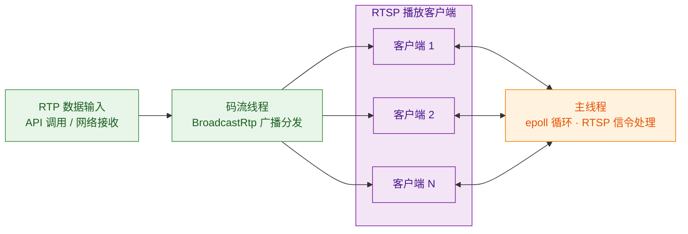

# rtsp_forward

[English Version](README_EN.md) | 中文版

rtsp_forward 是一个高性能的轻量级 RTSP 转发库，实现一个输入多路转发功能：外部输入 RTP 包，同时透传到多个 RTSP 客户端。。

## 功能特性

- **RTSP 协议支持**: OPTIONS、DESCRIBE、SETUP、PLAY、PAUSE、TEARDOWN、GET_PARAMETER、SET_PARAMETER
- **传输模式**: TCP interleaved / UDP
- **一个输入，多路转发**: 外部输入 RTP 包，同时透传到多个 RTSP 客户端
- **纯 C 接口**: 兼容 C/C++ 调用
- **双线程模型**: 主线程事件循环 + 码流输入线程
- **统计信息**: 活跃/播放会话数、累计连接数、超时统计
- **超时机制**: 连接阶段超时（30s）、会话阶段超时（60s）
- **日志级别控制**: 基于 log_kit 的 TRACE/DEBUG/INFO/WARN/ERROR/FATAL，支持 Socket 远程配置
- **高性能**: 环形缓冲区、零拷贝设计、避免不必要的内存分配

## 运行架构



**双线程模型：**
- **主线程**：运行 epoll 事件循环，处理 RTSP 信令（OPTIONS/DESCRIBE/SETUP/PLAY）和客户端连接
- **码流线程**：接收外部 RTP 输入，通过 `BroadcastRtp` 同时转发给所有播放中的客户端

## 编译

```bash
mkdir -p build && cd build
cmake ..
make -j4
```

编译产物：
- `librtsp_forward.a` - 静态库
- `librtsp_forward.so` - 动态库
- `rtsp_forward_demo` - 测试程序

## 快速测试

运行 demo（默认 RTSP 端口 8554，RTP 接收端口 5004）：

```bash
./build/rtsp_forward_demo
# 也可指定端口：./build/rtsp_forward_demo [rtsp_port] [rtp_port]
```

**1. ffmpeg 推流**（另开终端）：

```bash
# 测试图源
ffmpeg -re -f lavfi -i testsrc=size=640x480:rate=30 \
       -c:v libx264 -g 30 -f rtp rtp://127.0.0.1:5004

# 或推送视频文件
ffmpeg -re -i input.mp4 -an -c:v libx264 -g 30 \
       -f rtp rtp://127.0.0.1:5004
```

**2. VLC 拉流**：

打开网络流 `rtsp://localhost:8554`，或命令行：

```bash
vlc rtsp://localhost:8554
```

## 使用示例

```c
#include "rtsp_forward.h"

void* server = NULL;
RtspForwardConfig config = {
    .port = 554,
    .ip = "0.0.0.0",
    .max_sessions = 10,
    .buffer_size = 65536,
    .connection_timeout_sec = 30,
    .session_timeout_sec = 60,
};

// 创建服务器
int ret = rtsp_forward_create(&server, &config);
if (ret != RTSP_OK) {
    // 处理错误
    return;
}

// 设置 SDP
const char* sdp = "v=0\r\n"
                  "o=- 0 0 IN IP4 0.0.0.0\r\n"
                  "s=RTSP Stream\r\n"
                  "c=IN IP4 0.0.0.0\r\n"
                  "t=0 0\r\n"
                  "m=video 0 RTP/AVP 96\r\n"
                  "a=rtpmap:96 H264/90000\r\n";
rtsp_forward_set_sdp(server, sdp);

// 设置日志级别（可选）
rtsp_forward_set_log_level(RTSP_LOG_INFO);

// 启动服务器
ret = rtsp_forward_start(server);
if (ret != RTSP_OK) {
    rtsp_forward_destroy(server);
    return;
}

// 发送 RTP 数据（通常在另一个线程调用）
// uint8_t rtp_data[1500];
// size_t rtp_len = ...;
// rtsp_forward_send_rtp(server, rtp_data, rtp_len, 0);

// 运行事件循环（阻塞调用）
rtsp_forward_run(server);

// 停止服务器
rtsp_forward_stop(server);
rtsp_forward_destroy(server);
```

## API 接口

| 函数 | 功能 |
| :--- | :--- |
| `rtsp_forward_create` | 创建服务器实例 |
| `rtsp_forward_destroy` | 销毁服务器实例 |
| `rtsp_forward_start` | 启动服务器监听 |
| `rtsp_forward_stop` | 停止服务器 |
| `rtsp_forward_run` | 运行事件循环（阻塞） |
| `rtsp_forward_send_rtp` | 发送 RTP 包到所有播放会话 |
| `rtsp_forward_set_sdp` | 设置 SDP 内容 |
| `rtsp_forward_get_info` | 获取服务器信息（配置、状态、统计） |
| `rtsp_forward_set_log_level` | 设置日志级别 |
| `rtsp_forward_get_log_level` | 获取当前日志级别 |
| `rtsp_forward_version_string` | 获取版本号字符串 |

## 配置参数

```c
typedef struct RtspForwardConfig {
    int port;                   // 监听端口，默认554
    const char* ip;             // 监听地址，默认"0.0.0.0"
    int max_sessions;           // 最大并发会话数，默认10
    size_t buffer_size;         // 每个连接的缓冲区大小，默认65536
    const char* sdp_content;    // SDP内容，可为NULL
    int connection_timeout_sec; // 连接空闲超时（秒），默认30，0=不超时
    int session_timeout_sec;    // 会话空闲超时（秒），默认60，0=不超时
} RtspForwardConfig;
```

## 服务器信息

```c
typedef struct RtspForwardInfo {
    int port;                    // 监听端口
    int max_sessions;            // 最大并发会话数
    int running;                 // 是否运行中（1=运行，0=未运行）
    int active_sessions;         // 当前活跃会话数
    int playing_sessions;        // 当前播放中会话数
    uint64_t total_connections;  // 累计连接数
    uint64_t timed_out_sessions; // 因超时关闭的会话数
    uint64_t uptime_sec;         // 服务器运行时长（秒）
} RtspForwardInfo;
```

## 线程模型

本库采用双线程模型设计，需在不同线程中调用不同的API：

| 线程 | 职责 | 调用的 API |
| :--- | :--- | :--- |
| **主线程** | 运行事件循环，处理RTSP信令（OPTIONS/DESCRIBE/SETUP/PLAY等） | `rtsp_forward_run()` |
| **码流线程** | 输入RTP数据、动态更新SDP | `rtsp_forward_send_rtp()`、`rtsp_forward_set_sdp()` |

**重要提示**：`rtsp_forward_set_sdp` 支持运行时动态更新，需在**码流线程**中调用，而非主线程。当输入码流的编码格式改变时（如从H264切换到H265），可在码流线程中调用此接口更新SDP内容，新连接的客户端将获取最新的SDP。

## 线程安全

| API | 线程安全 | 说明 |
| :--- | :--- | :--- |
| `rtsp_forward_create` | ✅ | 可在任意线程调用 |
| `rtsp_forward_destroy` | ✅ | 确保没有其他线程在使用 server 后调用 |
| `rtsp_forward_start` | ✅ | 必须在 Run 之前调用 |
| `rtsp_forward_stop` | ✅ | 可在任意线程调用 |
| `rtsp_forward_run` | ✅ | 阻塞调用，运行 epoll 事件循环 |
| `rtsp_forward_send_rtp` | ✅ | 线程安全，可在码流输入线程调用 |
| `rtsp_forward_set_sdp` | ✅ | 线程安全，建议在码流线程中调用以实现动态更新 |
| `rtsp_forward_get_info` | ✅ | 可在任意线程调用 |

## 目录结构

```
rtsp_forward/
├── include/                     # 对外头文件
│   └── rtsp_forward.h           # C API 接口定义
├── src/                         # 源代码
│   ├── api/                     # C接口层
│   ├── buffer/                  # 缓冲区层
│   ├── core/                    # Server核心层
│   ├── net/                     # 网络工具层
│   ├── protocol/                # RTSP协议层
│   ├── rtp/                     # RTP层
│   └── util/                    # 工具层
├── demo/                        # 测试程序
├── doc/                         # 文档
├── CMakeLists.txt               # 编译配置
└── README.md                    # 项目说明
```
