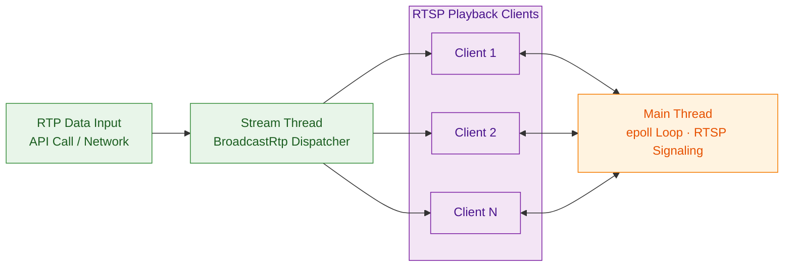

# rtsp_forward

rtsp_forward is a high-performance lightweight RTSP forwarding library that implements one-input multi-output forwarding: external RTP packets are input and simultaneously forwarded to multiple RTSP clients.

## Features

- **RTSP Protocol Support**: OPTIONS, DESCRIBE, SETUP, PLAY, PAUSE, TEARDOWN, GET_PARAMETER, SET_PARAMETER
- **Transport Modes**: TCP interleaved / UDP
- **One-input Multi-output**: External RTP input, simultaneously forwarded to multiple RTSP clients
- **Pure C API**: Compatible with C/C++ calls
- **Dual-thread Model**: Main thread event loop + stream input thread
- **Statistics**: Active/playing sessions, total connections, timeout statistics
- **Timeout Mechanism**: Connection timeout (30s), session timeout (60s)
- **Log Level Control**: TRACE/DEBUG/INFO/WARN/ERROR/FATAL
- **High Performance**: Ring buffer, zero-copy design, avoid unnecessary memory allocation

## Runtime Architecture



**Dual-thread Model:**
- **Main Thread**: Runs epoll event loop, handles RTSP signaling (OPTIONS/DESCRIBE/SETUP/PLAY) and client connections
- **Stream Thread**: Receives external RTP input, forwards to all playing clients via `BroadcastRtp`

## Build

```bash
mkdir -p build && cd build
cmake ..
make -j4
```

Build artifacts:
- `librtsp_forward.a` - Static library
- `librtsp_forward.so` - Dynamic library
- `rtsp_forward_demo` - Test program

## Quick Test

Run demo (default RTSP port 8554, RTP receive port 5004):

```bash
./build/rtsp_forward_demo
# Or specify ports: ./build/rtsp_forward_demo [rtsp_port] [rtp_port]
```

**1. ffmpeg Push Stream** (new terminal):

```bash
# Test source
ffmpeg -re -f lavfi -i testsrc=size=640x480:rate=30 \
       -c:v libx264 -g 30 -f rtp rtp://127.0.0.1:5004

# Or push video file
ffmpeg -re -i input.mp4 -an -c:v libx264 -g 30 \
       -f rtp rtp://127.0.0.1:5004
```

**2. VLC Pull Stream**:

Open network stream `rtsp://localhost:8554`, or via command line:

```bash
vlc rtsp://localhost:8554
```

## Usage Example

```c
#include "rtsp_forward.h"

void* server = NULL;
RtspForwardConfig config = {
    .port = 554,
    .ip = "0.0.0.0",
    .max_sessions = 10,
    .buffer_size = 65536,
    .connection_timeout_sec = 30,
    .session_timeout_sec = 60,
};

// Create server
int ret = rtsp_forward_create(&server, &config);
if (ret != RTSP_OK) {
    // Handle error
    return;
}

// Set SDP
const char* sdp = "v=0\r\n"
                  "o=- 0 0 IN IP4 0.0.0.0\r\n"
                  "s=RTSP Stream\r\n"
                  "c=IN IP4 0.0.0.0\r\n"
                  "t=0 0\r\n"
                  "m=video 0 RTP/AVP 96\r\n"
                  "a=rtpmap:96 H264/90000\r\n";
rtsp_forward_set_sdp(server, sdp);

// Set log level (optional)
rtsp_forward_set_log_level(LOG_INFO);

// Start server
ret = rtsp_forward_start(server);
if (ret != RTSP_OK) {
    rtsp_forward_destroy(server);
    return;
}

// Send RTP data (usually called in another thread)
// uint8_t rtp_data[1500];
// size_t rtp_len = ...;
// rtsp_forward_send_rtp(server, rtp_data, rtp_len, 0);

// Run event loop (blocking)
rtsp_forward_run(server);

// Stop server
rtsp_forward_stop(server);
rtsp_forward_destroy(server);
```

## API Reference

| Function | Description |
| :--- | :--- |
| `rtsp_forward_create` | Create server instance |
| `rtsp_forward_destroy` | Destroy server instance |
| `rtsp_forward_start` | Start server listening |
| `rtsp_forward_stop` | Stop server |
| `rtsp_forward_run` | Run event loop (blocking) |
| `rtsp_forward_send_rtp` | Send RTP packet to all playing sessions |
| `rtsp_forward_set_sdp` | Set SDP content |
| `rtsp_forward_get_info` | Get server info (config, status, statistics) |
| `rtsp_forward_set_log_level` | Set log level |
| `rtsp_forward_get_log_level` | Get current log level |
| `rtsp_forward_version_string` | Get version string |

## Configuration Parameters

```c
typedef struct RtspForwardConfig {
    int port;                   // Listening port, default 554
    const char* ip;             // Listening address, default "0.0.0.0"
    int max_sessions;           // Max concurrent sessions, default 10
    size_t buffer_size;         // Per-connection buffer size, default 65536
    const char* sdp_content;    // SDP content, can be NULL
    int connection_timeout_sec; // Connection idle timeout (seconds), default 30, 0=disabled
    int session_timeout_sec;    // Session idle timeout (seconds), default 60, 0=disabled
} RtspForwardConfig;
```

## Server Info

```c
typedef struct RtspForwardInfo {
    int port;                    // Listening port
    int max_sessions;            // Max concurrent sessions
    int running;                 // Running status (1=running, 0=stopped)
    int active_sessions;         // Current active sessions
    int playing_sessions;        // Current playing sessions
    uint64_t total_connections;  // Total connections
    uint64_t timed_out_sessions; // Sessions closed due to timeout
    uint64_t uptime_sec;         // Server uptime (seconds)
} RtspForwardInfo;
```

## Thread Model

This library uses a dual-thread model design. Different APIs must be called from different threads:

| Thread | Responsibility | APIs to Call |
| :--- | :--- | :--- |
| **Main Thread** | Run event loop, handle RTSP signaling (OPTIONS/DESCRIBE/SETUP/PLAY) | `rtsp_forward_run()` |
| **Stream Thread** | Input RTP data, dynamically update SDP | `rtsp_forward_send_rtp()`, `rtsp_forward_set_sdp()` |

**Important**: `rtsp_forward_set_sdp` supports runtime dynamic updates and should be called from the **stream thread**, not the main thread. When the input stream's encoding format changes (e.g., from H264 to H265), call this API in the stream thread to update SDP content. Newly connected clients will get the updated SDP.

## Thread Safety

| API | Thread Safe | Notes |
| :--- | :--- | :--- |
| `rtsp_forward_create` | ✅ | Can be called from any thread |
| `rtsp_forward_destroy` | ✅ | Ensure no other thread is using the server |
| `rtsp_forward_start` | ✅ | Must be called before Run |
| `rtsp_forward_stop` | ✅ | Can be called from any thread |
| `rtsp_forward_run` | ✅ | Blocking call, runs epoll event loop |
| `rtsp_forward_send_rtp` | ✅ | Thread-safe, can be called from stream thread |
| `rtsp_forward_set_sdp` | ✅ | Thread-safe, recommended to call from stream thread |
| `rtsp_forward_get_info` | ✅ | Can be called from any thread |

## Directory Structure

```
rtsp_forward/
├── include/                     # Public headers
│   └── rtsp_forward.h           # C API definitions
├── src/                         # Source code
│   ├── api/                     # C API layer
│   ├── buffer/                  # Buffer layer
│   ├── core/                    # Server core layer
│   ├── net/                     # Network utilities
│   ├── protocol/                # RTSP protocol layer
│   ├── rtp/                     # RTP layer
│   └── util/                    # Utilities
├── demo/                        # Test program
├── doc/                         # Documentation
├── CMakeLists.txt               # Build configuration
├── README.md                    # Project description (Chinese)
└── README_EN.md                 # Project description (English)
```
